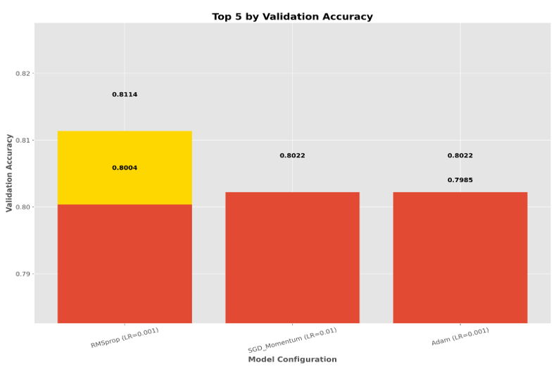

```markdown
# Deep Learning — Final Project (Pneumonia Detection from Chest X-rays)

Author: MariaNakhle  
Repository: MariaNakhle/DEEP-LEARNING---Final-Project

---

## Project overview

This repository contains code and documentation for a deep-learning project that experiments with CNNs for detecting pneumonia from chest X-ray images. The work includes:

- A custom CNN trained from scratch
- Transfer learning with ResNet152V2 (frozen and fine-tuned)
- Training/evaluation pipelines with precision-recall / F1 threshold analysis
- Optimizer comparisons and early stopping experiments
- A demonstration of a simulated multi-class evaluation (Normal, Bacterial, Viral) built on the binary dataset

I reviewed the code files in this repository and summarized each script, described their inputs/outputs, and created usage instructions in this README for easy reproduction.

### Sample Dataset Images


*Examples of pneumonia and normal chest X-ray images from the dataset.*

---

## Repository structure

- `Task1NEW.py`  
  - Model architecture definitions, dataset loading and preprocessing utilities, and model diagram/table generation helpers.
  - Implements:
    - `create_cnn_without_transfer_learning()` — custom CNN (4 conv blocks + dense head)
    - `create_cnn_with_transfer_learning_frozen()` — ResNet152V2 base, frozen
    - `create_cnn_with_transfer_learning_finetuned()` — ResNet152V2 base, partial fine-tuning
  - Utilities for saving model diagrams & architecture tables (Graphviz/pydot optional).
  - Visualizes dataset samples and saves images under `images/Task1`.

- `Task2New.py`  
  - Training and evaluation pipeline for the models defined in Task 1.
  - Training helper: `train_model_with_history()` and `plot_training_history()`.
  - Precision-Recall and threshold analysis: `evaluate_with_thresholds()` and `plot_precision_recall_analysis()`.
  - Runs training for all models, performs PR analysis, and saves figures under `images/Task2`.

- `Task3New.py`  
  - Optimizer comparisons (SGD, SGD+momentum, Adam, RMSprop), hyperparameter sweeps, and early stopping experiments.
  - Functions: training loops (`train_with_optimizer`), early stopping runner (`train_with_early_stopping`), plotting/comparison helpers.
  - Saves multiple plots per experiment under `images/Task3` and writes out the best model (`best_model_task3_overall.h5`).

- `Task4.py`  
  - Multi-class (simulated) demonstration. The dataset is binary (NORMAL / PNEUMONIA); this script simulates a 3-class scenario (NORMAL, BACTERIAL, VIRAL) for report demonstration.
  - Contains a CNN architecture similar to the custom model used elsewhere, optimizer sweeps, training history plotting, and a routine that builds a *simulated* 3x3 confusion matrix and a classification report for reporting purposes.
  - Saves sample images and confusion matrix to `images/`.

- Reports / documentation:
  - `deep-learning project report NEW.docx` — full project report (Word).
  - `פרוייקט מערכות לומדות למידה עמוקה.pdf` — PDF report (Hebrew).

---

## Dataset expected layout

The scripts expect the Chest X-ray dataset to be available in the repository (or accessible path) with the following nested layout:

chest_xray/
  └─ chest_xray/
     ├─ train/
     │  ├─ NORMAL/
     │  └─ PNEUMONIA/
     ├─ val/       (Task1 expects `val/` folder when loading directly)
     └─ test/

Notes:
- `Task1NEW.py`, `Task2New.py`, `Task3New.py`, and `Task4.py` use the `DATA_PATH` variable defined inside each file. By default it is set to:
  - `os.path.join("chest_xray", "chest_xray")`
- Some scripts assume `train`, `val`, and `test` directories exist; `Task4.py` uses an internal validation split on `train` if `val` is not present.

If your dataset is located elsewhere, update the `DATA_PATH` variable in the corresponding script(s).

---

## Requirements (high level)

General dependencies used across scripts:

- Python 3.8+ (recommended)
- TensorFlow (tested with TF 2.x)
- numpy
- matplotlib
- scikit-learn
- pydot and Graphviz (optional — only for saving model diagrams via `plot_model`)
- (Other helper libs: warnings, os, shutil — standard library)

Install common Python dependencies with pip:

pip install tensorflow numpy matplotlib scikit-learn pydot graphviz

Notes:
- Graphviz must be installed at the OS level (so that `dot` is on PATH) for model-to-diagram export to work.
- If using GPU training, install the GPU-enabled TensorFlow and ensure CUDA/cuDNN versions are compatible.

---

## Quickstart — Running the tasks

1. Place the dataset in the expected `chest_xray/chest_xray` layout (or update `DATA_PATH` in the scripts).

2. Task 1 — model creation and architecture diagrams
   - Run:
     python Task1NEW.py
   - Outputs:
     - Model summaries printed to console.
     - Architecture diagrams and tables (saved to `images/Task1/` when Graphviz/pydot are available).
     - Sample dataset images saved to `images/Task1/`.

3. Task 2 — training and precision-recall analysis
   - Run:
     python Task2New.py
   - Behavior:
     - Loads models from `Task1NEW` and trains them (default 20 epochs in the script).
     - Plots training histories and computes precision/recall across thresholds (0.1–0.9 by 0.05).
     - Saves PR analysis plots to `images/Task2/`.
   
   
   
   *Training and evaluation results for Task 2*

4. Task 3 — optimizer comparison & early stopping
   - Run:
     python Task3New.py
   - Behavior:
     - Sweeps optimizers and learning rates, saves training histories to `images/Task3/`.
     - Selects best config and trains with early stopping; saves the best model (HDF5) in repo root.
   
   
   
   *Optimizer comparison and early stopping results for Task 3*

5. Task 4 — multi-class demonstration and confusion-matrix
   - Run:
     python Task4.py
   - Behavior:
     - Trains multiple experiments (different optimizers / LRs / epochs), selects best and builds a simulated 3-class confusion matrix for reporting.
     - Saves sample images, training plots, and final confusion matrix to `images/`.
   
   
   
   *Task 4 training results and model performance*
   
   
   
   *Task 4 confusion matrix and classification metrics*

---

## Typical outputs and where to find them

- All image outputs are saved under the `images/` directory, separated by task:
  - `images/Task1/` — model diagrams, architecture tables, sample images
  - `images/Task2/` — training histories, precision-recall analysis
  - `images/Task3/` — optimizer comparison plots, early stopping comparisons
  - `images/` (root) — Task4 plots (sample images, confusion matrix, summary plots)

- Saved model for Task 3 best run:
  - `best_model_task3_overall.h5` (created by Task3)

---

## Important implementation notes & tips

- Reproducibility:
  - The scripts set random seeds for TensorFlow and NumPy (seed=42).
  - Batch size and input image size are set centrally in each file (commonly 32 and 160×160).

- Transfer learning details:
  - ResNet152V2 (ImageNet weights) is used as a feature extractor.
  - Two approaches are implemented:
    - Frozen base (train only the added head)
    - Fine-tuning (unfreeze top layers — code unfreezes layers from index 540 onward)

- Training hyperparameters:
  - Default learning rate in the model definitions is low (e.g., 1e-4).
  - Task2 and Task3 perform additional sweeps and comparisons (epochs, optimizers, LR).

- Visualizations:
  - The plotting functions intentionally generate high-resolution figures with descriptive annotations for inclusion in reports (Word/PDF).
  - Graphviz/pydot availability is checked before trying to save `plot_model` outputs. If missing, diagram saving is skipped gracefully.

- Task4 is demonstrative:
  - The "multi-class" result is simulated by splitting the binary pneumonia class into two pseudo-classes (BACTERIAL and VIRAL) for reporting illustrations — the dataset itself is still binary.

---

## Troubleshooting

- Dataset loading errors:
  - Ensure `DATA_PATH` points to the correct folder and that each class folder contains images.
  - If `image_dataset_from_directory` raising errors, check for corrupted or non-image files inside the class folders.

- Graphviz/model plots:
  - If model diagrams do not save, install Graphviz (OS-level) and the Python `pydot` package, and make sure `dot` is on your PATH.

- GPU / TensorFlow issues:
  - Verify CUDA / cuDNN installation and TensorFlow compatibility.
  - If training is slow on CPU, reduce batch size or image size to speed up experimentation.

---

## Where I looked & what I extracted

I reviewed each Task script to extract:
- the high-level purpose,
- the key functions and their roles,
- expected dataset layout,
- produced outputs and where they are saved,
- dependencies and optional tools (Graphviz/pydot).

This README summarizes the above so you can quickly run experiments and generate figures for the report.

